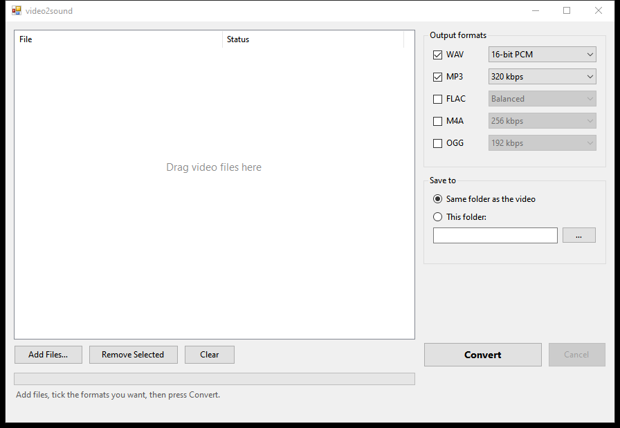

# video2sound

Pull the audio out of a video. Drop files in, tick the formats you want, press
Convert.



A small Windows app that extracts the audio track from video files into up to
five formats in one pass.

| Format | Codec | Quality choices |
| ------ | ----- | --------------- |
| WAV | PCM | 16-bit, 24-bit, 32-bit float |
| MP3 | LAME | 320 / 256 / 192 / 128 kbps |
| FLAC | FLAC | Balanced, Smallest, Fastest |
| M4A | AAC | 256 / 192 / 128 kbps |
| OGG | Vorbis | 320 / 192 / 128 kbps |

## Install

**Download the bundle.** Grab `video2sound-2.0.0-win64.zip` from the
[latest release](https://github.com/mobius29er/video2sound/releases/latest),
unzip it anywhere, and run `video2sound.exe`. ffmpeg is included -- nothing to
install, nothing to configure. Keep `ffmpeg.exe` next to `video2sound.exe`.

**Or bring your own ffmpeg.** Take just `video2sound.exe` and make sure
[ffmpeg](https://ffmpeg.org/download.html) is on your `PATH`. The program looks
for `ffmpeg.exe` beside itself first, then falls back to `PATH`.

There is no runtime to install either way: it targets the .NET Framework that
ships with Windows.

## Use

1. **Add files** -- drag videos onto the window, or press *Add Files...*.
   Dropping a folder adds everything in it. Any format ffmpeg reads works:
   `.mp4`, `.mkv`, `.mov`, `.webm`, `.avi`, and so on.
2. **Tick the formats** you want. Each has a quality dropdown with a sensible
   default already selected.
3. **Choose where they go** -- the video's own folder by default, or any folder
   you pick.
4. **Convert.** Progress and per-file status show in the list; *Cancel* stops
   immediately rather than at the end of the current file.

Dragging video files directly onto `video2sound.exe` also works -- they arrive
pre-loaded in the queue.

### About the output folder

If the source folder is read-only, output goes to your `Downloads` folder
instead (then `Desktop`), and the app tells you it did that.

This is not a rare edge case. Windows Controlled Folder Access protects
`Videos`, `Pictures` and `Documents` by default, which is exactly where video
files tend to live.

## Build from source

Needs nothing but Windows -- no SDK, no toolchain, no downloads:

```
build.bat
```

It compiles with the C# compiler bundled in the .NET Framework
(`%WINDIR%\Microsoft.NET\Framework64\v4.0.30319\csc.exe`).

Source layout:

| File | Role |
| ---- | ---- |
| `src/Program.cs` | Entry point |
| `src/MainForm.cs` | The window and all UI behaviour |
| `src/Converter.cs` | Runs ffmpeg, handles cancellation and errors |
| `src/Formats.cs` | Format/quality definitions, ffmpeg discovery, path handling |

See [docs/DESIGN.md](docs/DESIGN.md) for why it is built this way.

## Notes

- Files with no audio track fail with a message rather than writing an empty file.
- Existing files of the same name are overwritten.
- Converting an audio file into its own format writes `name (converted).ext`
  rather than destroying the input.
- Each format is a separate ffmpeg run, so one failure doesn't take down the rest.

## License

video2sound is MIT licensed -- see [LICENSE](LICENSE).

The release bundle also ships `ffmpeg.exe`, which is separate software under the
**GNU GPL v3** (this is an `--enable-gpl --enable-version3` build). Its full
license text is included in the zip as `LICENSE-ffmpeg.txt`. video2sound runs
ffmpeg as a separate process and is neither derived from it nor linked against
it, so the two are merely aggregated and this project stays MIT.

Bundled build: ffmpeg 7.1.1-essentials_build from <https://www.gyan.dev/ffmpeg/builds/>.
FFmpeg source is available from <https://ffmpeg.org/download.html> and
<https://ffmpeg.org/releases/>.
